# Primary Workflows

V1 scope: foundational platform and operational spine (vendor → contractor → assignment → timesheet → invoice approval → pay). Vendor agreement e-sign (SLA, SOW, NDA, MSA via DocuSign), contractor performance concern flagging, and quarterly contractor ratings are in scope. Hiring orchestration beyond MRF intake, bulk import, and contractor offer e-sign are deferred to `FUTURE-WORKFLOWS.md`.

## How to read these diagrams

Each step follows the same visual pattern:

| Shape | Meaning |
|-------|---------|
| **Cloud (☁)** | What must be in place **before** this step can happen |
| **Square box** | **Who** performs the step (the actor / role) |
| **Circle** | **What** happens in this step (the action) |

Inside every cloud you will see two parts:
- **NEEDED** — documents, data, or prior approvals required
- **CHECKED BY** — the person or team who validates the step

Steps flow **top to bottom** in this order for every step: **cloud → square box → circle**. Read what is needed and who checks it, then see who acts, then what happens. Move down to the next step.

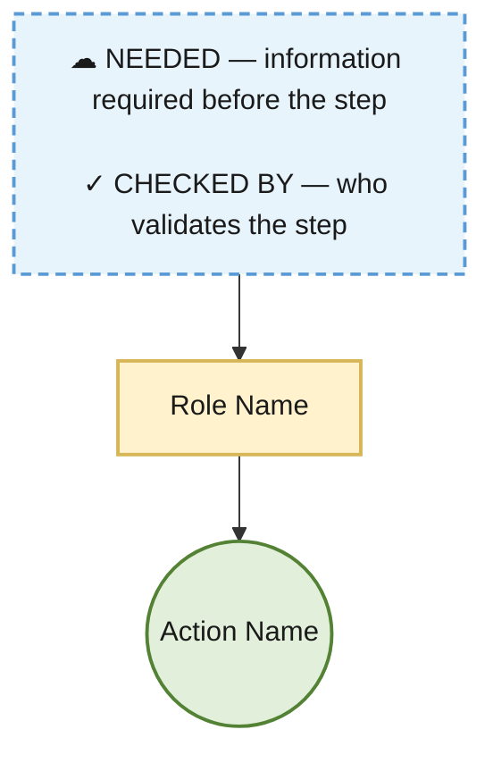

**Workflow index (22 workflows — mirrored in `PRIMARY-WORKFLOWS-EASY.md`):**

| Section | Workflow |
|---------|----------|
| Platform | User & Role Management · Central Approval Queue · Audit Log & Notifications · Document Repository |
| Master Data | Vendor Registration, Onboarding & Compliance · Rate Card Lifecycle · Holiday Calendar Management |
| People | Contractor Onboarding & Activation · Project Assignment · Assignment Transfer · Contractor Exit / Deboarding |
| Operations | Manpower Request (MRF) Intake · Contractor Leave Request · Timesheet Submission & Confirmation · Reporting Anomaly Detection & Resolution · Contractor Performance Concern & Work Verification · Contractor Quarterly Performance Rating |
| Money | Contractor Rate Lifecycle · Finance Payment Batch · Invoice Approval · Invoice Payment & Settlement |

---

## Platform

### User & Role Management (System Admin)

```mermaid
flowchart TD
  classDef cloud fill:#e8f4fc,stroke:#5b9bd5,stroke-width:2px,stroke-dasharray:6 4,color:#1a1a1a
  classDef actor fill:#fff2cc,stroke:#d6b656,stroke-width:2px,color:#1a1a1a
  classDef action fill:#e2efda,stroke:#548235,stroke-width:2px,color:#1a1a1a

  c1["☁ NEEDED<br/>• Approved access request<br/>• Worker identity and company email<br/>• Department, manager, employment status<br/>• Requested start and end dates<br/><br/>✓ CHECKED BY<br/>User's Manager and HR"]
  a1["TAQ / System Admin"]
  s1(("Create User"))

  c2["☁ NEEDED<br/>• Approved role and permissions<br/>• Least-privilege access matrix<br/>• Segregation-of-duties check<br/><br/>✓ CHECKED BY<br/>System Owner / Information Security"]
  a2["TAQ / System Admin"]
  s2(("Assign Role & Permissions"))

  c3["☁ NEEDED<br/>• Active account<br/>• Verified email<br/>• MFA enrollment<br/><br/>✓ CHECKED BY<br/>System Admin through authentication logs"]
  a3["User"]
  s3(("Login via RBAC Portal"))

  c4["☁ NEEDED<br/>• Assigned role<br/>• Current permission policy<br/>• Active session<br/><br/>✓ CHECKED BY<br/>System Owner through periodic access review"]
  a4["System"]
  s4(("Enforce Role-Scoped Screen Access"))

  c1 --> a1
  a1 --> s1
  s1 --> c2
  c2 --> a2
  a2 --> s2
  s2 --> c3
  c3 --> a3
  a3 --> s3
  s3 --> c4
  c4 --> a4
  a4 --> s4

  class c1,c2,c3,c4 cloud
  class a1,a2,a3,a4 actor
  class s1,s2,s3,s4 action
```

---

### Central Approval Queue

```mermaid
flowchart TD
  classDef cloud fill:#e8f4fc,stroke:#5b9bd5,stroke-width:2px,stroke-dasharray:6 4,color:#1a1a1a
  classDef actor fill:#fff2cc,stroke:#d6b656,stroke-width:2px,color:#1a1a1a
  classDef action fill:#e2efda,stroke:#548235,stroke-width:2px,color:#1a1a1a

  c1["☁ NEEDED<br/>• Complete entity record<br/>• Supporting documents<br/>• Requester comments and change reason<br/><br/>✓ CHECKED BY<br/>Requester's Manager / Workflow Owner"]
  a1["Requester"]
  s1(("Submit Entity for Approval"))

  c2["☁ NEEDED<br/>• Entity type and approval matrix<br/>• Value threshold rules<br/>• Requester and approver must be separate<br/><br/>✓ CHECKED BY<br/>System Admin through routing-rule review"]
  a2["System"]
  s2(("Route to Approver Role"))

  c3["☁ NEEDED<br/>• Complete request and evidence<br/>• Policy checklist<br/>• Prior approval history<br/><br/>✓ CHECKED BY<br/>Approver's Functional Lead"]
  a3["Approver"]
  s3(("Review Request"))

  c4["☁ NEEDED<br/>• Review decision and comments<br/>• Rejection reason or approval evidence<br/><br/>✓ CHECKED BY<br/>Workflow Owner / Secondary Approver"]
  a4["Approver"]
  s4(("Approve or Reject"))

  c5["☁ NEEDED<br/>• Actor, timestamp, entity version<br/>• Decision and comments<br/><br/>✓ CHECKED BY<br/>Compliance / Internal Audit"]
  a5["System"]
  s5(("Record Audit Log Entry"))

  c1 --> a1
  a1 --> s1
  s1 --> c2
  c2 --> a2
  a2 --> s2
  s2 --> c3
  c3 --> a3
  a3 --> s3
  s3 --> c4
  c4 --> a4
  a4 --> s4
  s4 --> c5
  c5 --> a5
  a5 --> s5

  class c1,c2,c3,c4,c5 cloud
  class a1,a2,a3,a4,a5 actor
  class s1,s2,s3,s4,s5 action
```

_Routing: Vendor → Finance · Rate Card → Finance · Contractor Rate → Finance · Transfer → HR · MRF → TAQ · Invoice → Project Manager / Finance_

---

### Audit Log & Notifications

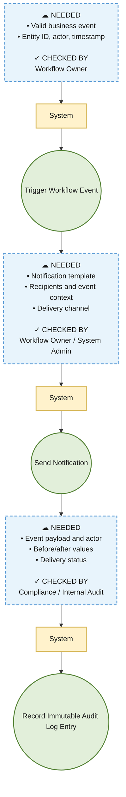

---

### Document Repository

```mermaid
flowchart TD
  classDef cloud fill:#e8f4fc,stroke:#5b9bd5,stroke-width:2px,stroke-dasharray:6 4,color:#1a1a1a
  classDef actor fill:#fff2cc,stroke:#d6b656,stroke-width:2px,color:#1a1a1a
  classDef action fill:#e2efda,stroke:#548235,stroke-width:2px,color:#1a1a1a

  c1["☁ NEEDED<br/>• Document type and owner/entity<br/>• Issue date and expiry date<br/>• Readable authorized file<br/><br/>✓ CHECKED BY<br/>HR / Functional Document Owner"]
  a1["User"]
  s1(("Upload Document"))

  c2["☁ NEEDED<br/>• Original file and metadata<br/>• Issuer details<br/>• Authenticity and completeness checklist<br/><br/>✓ CHECKED BY<br/>HR / Compliance"]
  a2["HR / System"]
  s2(("Verify Document"))

  c3["☁ NEEDED<br/>• Verified status<br/>• Access classification and retention period<br/>• Version number<br/><br/>✓ CHECKED BY<br/>Records Owner / System Admin"]
  a3["System"]
  s3(("Store with Version History"))

  c4["☁ NEEDED<br/>• Expiry date and renewal owner<br/>• Alert period<br/><br/>✓ CHECKED BY<br/>HR / Compliance through expiry report"]
  a4["System"]
  s4(("Track Expiry"))

  c1 --> a1
  a1 --> s1
  s1 --> c2
  c2 --> a2
  a2 --> s2
  s2 --> c3
  c3 --> a3
  a3 --> s3
  s3 --> c4
  c4 --> a4
  a4 --> s4

  class c1,c2,c3,c4 cloud
  class a1,a2,a3,a4 actor
  class s1,s2,s3,s4 action
```

---

## Master Data

### Vendor Registration, Onboarding & Compliance


---

### Rate Card Lifecycle

```mermaid
flowchart TD
  classDef cloud fill:#e8f4fc,stroke:#5b9bd5,stroke-width:2px,stroke-dasharray:6 4,color:#1a1a1a
  classDef actor fill:#fff2cc,stroke:#d6b656,stroke-width:2px,color:#1a1a1a
  classDef action fill:#e2efda,stroke:#548235,stroke-width:2px,color:#1a1a1a

  c1["☁ NEEDED<br/>• Vendor, project/service, role/skill, grade<br/>• Location, currency, rate unit<br/>• Effective dates and proposed bill/pay rates<br/><br/>✓ CHECKED BY<br/>HR / Commercial Owner"]
  a1["HR / Vendor"]
  s1(("Draft Rate Card"))

  c2["☁ NEEDED<br/>• Market benchmark<br/>• Min/max pay rate and bill rate<br/>• Markup, overtime, and tax rules<br/><br/>✓ CHECKED BY<br/>HR and Procurement / Commercial Lead"]
  a2["Vendor"]
  s2(("Negotiate Bill/Pay Rates"))

  c3["☁ NEEDED<br/>• Agreed rates and negotiation record<br/>• Margin check and budget impact<br/>• Effective period<br/><br/>✓ CHECKED BY<br/>HR Lead"]
  a3["HR"]
  s3(("Submit for Finance Approval"))

  c4["☁ NEEDED<br/>• Approved budget and benchmark<br/>• Acceptable margin and tax treatment<br/>• Contract alignment<br/><br/>✓ CHECKED BY<br/>Finance Approver / Finance Head"]
  a4["Finance"]
  s4(("Approve Rate Card"))

  c5["☁ NEEDED<br/>• Finance approval and effective date<br/>• Non-overlapping version<br/>• Linked vendor/project<br/><br/>✓ CHECKED BY<br/>Finance Operations"]
  a5["System"]
  s5(("Activate Rate Card"))

  c6["☁ NEEDED<br/>• New approved version and change reason<br/>• Effective date<br/>• Impacted assignments identified<br/><br/>✓ CHECKED BY<br/>HR and Finance"]
  a6["System"]
  s6(("Supersede Old Version"))

  c1 --> a1
  a1 --> s1
  s1 --> c2
  c2 --> a2
  a2 --> s2
  s2 --> c3
  c3 --> a3
  a3 --> s3
  s3 --> c4
  c4 --> a4
  a4 --> s4
  s4 --> c5
  c5 --> a5
  a5 --> s5
  s5 --> c6
  c6 --> a6
  a6 --> s6

  class c1,c2,c3,c4,c5,c6 cloud
  class a1,a2,a3,a4,a5,a6 actor
  class s1,s2,s3,s4,s5,s6 action
```

---

### Holiday Calendar Management

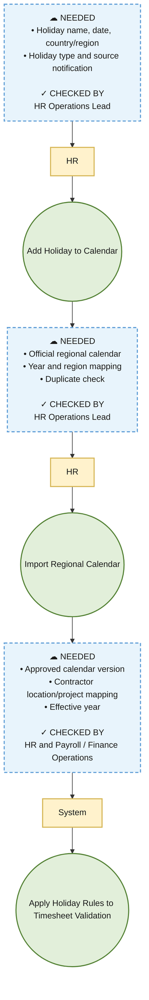

---

## People

### Contractor Onboarding & Activation

**Choose one entry path, then continue through the common pipeline.**

**HR-initiated:** HR - Enter Basic Info -> HR - Select Vendor, Project & Reporting Manager -> HR - Capture Engagement Terms (Project Name, Pay Rate, Start/End Dates, FTE Conversion Eligibility)

**Vendor-initiated:** HR / Vendor - Register Contractor as Applied -> HR - Capture Engagement Terms (Project Name, Pay Rate, Start/End Dates, FTE Conversion Eligibility)

**Required engagement information:** project name, contractor pay rate (and bill rate where applicable), assignment start date, contract/assignment end date, and whether conversion to FTE is possible at the end of tenure.

**Common pipeline:** Contractor - Upload Documents to HR -> HR - Initiate BGV -> Contractor - Provide BGV Consent & Documents -> HR - Upload BGV Report -> HR - Verify & Mark BGV Cleared -> HR - Send Offer (Including Project, Rates, Tenure & FTE Conversion Terms) -> Contractor - Sign Offer -> HR - Create Assignment (Draft/Pending) -> HR - Create Contractor Rate -> System - Validate Assignment & Rate Card Alignment -> HR - Submit Rate for Finance Approval -> Finance - Approve Rate -> System - Activate Assignment -> System - Activate Contractor

#### Entry A — HR-initiated

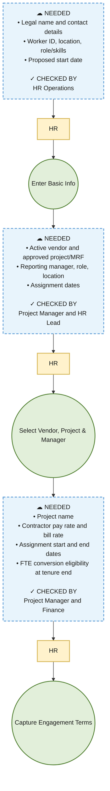

#### Entry B — Vendor-initiated

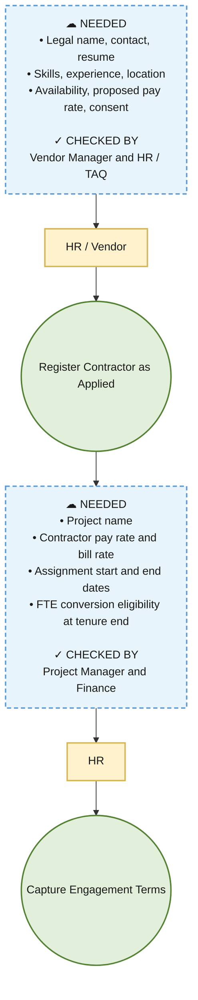

#### Common pipeline (both entries)

```mermaid
flowchart TD
  classDef cloud fill:#e8f4fc,stroke:#5b9bd5,stroke-width:2px,stroke-dasharray:6 4,color:#1a1a1a
  classDef actor fill:#fff2cc,stroke:#d6b656,stroke-width:2px,color:#1a1a1a
  classDef action fill:#e2efda,stroke:#548235,stroke-width:2px,color:#1a1a1a

  c1["☁ NEEDED<br/>• NDA, identity, address, bank, tax proof<br/>• Education/employment proof and BGV consent<br/>• Required certifications<br/><br/>✓ CHECKED BY<br/>HR / Compliance"]
  a1["Contractor"]
  s1(("Upload Documents to HR"))

  c2["☁ NEEDED<br/>• Signed consent and identity details<br/>• Check scope and approved BGV provider<br/><br/>✓ CHECKED BY<br/>HR Compliance Lead"]
  a2["HR"]
  s2(("Initiate BGV"))

  c3["☁ NEEDED<br/>• Signed consent<br/>• Complete and authentic supporting documents<br/><br/>✓ CHECKED BY<br/>HR / BGV Provider"]
  a3["Contractor"]
  s3(("Provide BGV Consent & Documents"))

  c4["☁ NEEDED<br/>• Provider report and check references<br/>• Result date and discrepancy details<br/><br/>✓ CHECKED BY<br/>HR Compliance Lead"]
  a4["HR"]
  s4(("Upload BGV Report"))

  c5["☁ NEEDED<br/>• Complete BGV result<br/>• Discrepancy assessment<br/>• Exception approval where applicable<br/><br/>✓ CHECKED BY<br/>HR Lead / Compliance"]
  a5["HR"]
  s5(("Verify & Mark BGV Cleared"))

  c6["☁ NEEDED<br/>• Project name and approved role<br/>• Pay rate, bill rate, and work location<br/>• Start/end dates and FTE conversion terms<br/>• Policies and conditions<br/><br/>✓ CHECKED BY<br/>HR Lead and Finance for compensation"]
  a6["HR"]
  s6(("Send Offer (Including Project, Rates, Tenure & FTE Conversion Terms)"))

  c7["☁ NEEDED<br/>• Final offer including project, rates, tenure<br/>• FTE conversion eligibility stated<br/>• Terms acceptance, signature, identity confirmation<br/><br/>✓ CHECKED BY<br/>HR"]
  a7["Contractor"]
  s7(("Sign Offer"))

  c8["☁ NEEDED<br/>• Project name and active project<br/>• Reporting manager, role, allocation, location<br/>• Start/end dates and FTE conversion flag<br/>• Approved MRF/position<br/><br/>✓ CHECKED BY<br/>Project Manager and HR Lead"]
  a8["HR"]
  s8(("Create Assignment (Draft/Pending)"))

  c9["☁ NEEDED<br/>• Approved rate card<br/>• Pay/bill rate, currency, unit, overtime<br/>• Effective dates and assignment<br/><br/>✓ CHECKED BY<br/>HR Lead"]
  a9["HR"]
  s9(("Create Contractor Rate"))

  c10["☁ NEEDED<br/>• Active vendor/project and assignment dates<br/>• Role/skill/grade and rate-card version<br/>• Budget availability<br/><br/>✓ CHECKED BY<br/>HR and Finance through exception review"]
  a10["System"]
  s10(("Validate Assignment & Rate Card Alignment"))

  c11["☁ NEEDED<br/>• Passed alignment check<br/>• Margin/budget impact and rate evidence<br/>• Exception reason if any<br/><br/>✓ CHECKED BY<br/>HR Lead"]
  a11["HR"]
  s11(("Submit Rate for Finance Approval"))

  c12["☁ NEEDED<br/>• Rate card match and approved budget<br/>• Acceptable margin and effective dates<br/>• Segregation of duties<br/><br/>✓ CHECKED BY<br/>Finance Approver / Finance Head"]
  a12["Finance"]
  s12(("Approve Rate"))

  c13["☁ NEEDED<br/>• Approved rate and assignment<br/>• Cleared onboarding controls<br/>• Effective date<br/><br/>✓ CHECKED BY<br/>HR Operations Lead"]
  a13["System"]
  s13(("Activate Assignment"))

  c14["☁ NEEDED<br/>• Active assignment and active rate<br/>• BGV clearance and signed offer<br/>• Complete mandatory documents<br/><br/>✓ CHECKED BY<br/>HR Operations Lead"]
  a14["System"]
  s14(("Activate Contractor"))

  c1 --> a1
  a1 --> s1
  s1 --> c2
  c2 --> a2
  a2 --> s2
  s2 --> c3
  c3 --> a3
  a3 --> s3
  s3 --> c4
  c4 --> a4
  a4 --> s4
  s4 --> c5
  c5 --> a5
  a5 --> s5
  s5 --> c6
  c6 --> a6
  a6 --> s6
  s6 --> c7
  c7 --> a7
  a7 --> s7
  s7 --> c8
  c8 --> a8
  a8 --> s8
  s8 --> c9
  c9 --> a9
  a9 --> s9
  s9 --> c10
  c10 --> a10
  a10 --> s10
  s10 --> c11
  c11 --> a11
  a11 --> s11
  s11 --> c12
  c12 --> a12
  a12 --> s12
  s12 --> c13
  c13 --> a13
  a13 --> s13
  s13 --> c14
  c14 --> a14
  a14 --> s14

  class c1,c2,c3,c4,c5,c6,c7,c8,c9,c10,c11,c12,c13,c14 cloud
  class a1,a2,a3,a4,a5,a6,a7,a8,a9,a10,a11,a12,a13,a14 actor
  class s1,s2,s3,s4,s5,s6,s7,s8,s9,s10,s11,s12,s13,s14 action
```

---

### Project Assignment

```mermaid
flowchart TD
  classDef cloud fill:#e8f4fc,stroke:#5b9bd5,stroke-width:2px,stroke-dasharray:6 4,color:#1a1a1a
  classDef actor fill:#fff2cc,stroke:#d6b656,stroke-width:2px,color:#1a1a1a
  classDef action fill:#e2efda,stroke:#548235,stroke-width:2px,color:#1a1a1a

  c1["☁ NEEDED<br/>• Active contractor<br/>• Skills/role match and availability<br/>• Compliance clearance<br/><br/>✓ CHECKED BY<br/>HR and Project Manager"]
  a1["HR"]
  s1(("Select Contractor"))

  c2["☁ NEEDED<br/>• Active project and approved MRF/position<br/>• Role, work location, assignment need<br/><br/>✓ CHECKED BY<br/>Project Manager / Program Manager"]
  a2["HR"]
  s2(("Assign to Project"))

  c3["☁ NEEDED<br/>• Active manager and project membership<br/>• Reporting relationship and backup approver<br/><br/>✓ CHECKED BY<br/>Project / Program Manager"]
  a3["HR"]
  s3(("Set Reporting Manager"))

  c4["☁ NEEDED<br/>• Allocation percentage<br/>• Start/end dates and capacity check<br/>• Project budget<br/><br/>✓ CHECKED BY<br/>Project Manager and Finance / PMO"]
  a4["HR"]
  s4(("Set Allocation & Start Date"))

  c5["☁ NEEDED<br/>• Complete assignment and approved rate<br/>• No date/allocation conflict<br/>• Manager acceptance<br/><br/>✓ CHECKED BY<br/>HR Lead"]
  a5["HR"]
  s5(("Approve Assignment"))

  c6["☁ NEEDED<br/>• HR approval, active rate<br/>• Valid project/vendor/contractor<br/>• Effective date<br/><br/>✓ CHECKED BY<br/>HR Operations Lead"]
  a6["System"]
  s6(("Activate Assignment"))

  c1 --> a1
  a1 --> s1
  s1 --> c2
  c2 --> a2
  a2 --> s2
  s2 --> c3
  c3 --> a3
  a3 --> s3
  s3 --> c4
  c4 --> a4
  a4 --> s4
  s4 --> c5
  c5 --> a5
  a5 --> s5
  s5 --> c6
  c6 --> a6
  a6 --> s6

  class c1,c2,c3,c4,c5,c6 cloud
  class a1,a2,a3,a4,a5,a6 actor
  class s1,s2,s3,s4,s5,s6 action
```

_Note: New contractors receive their first assignment during onboarding. Use this workflow for reassignment outside of a formal transfer._

---

### Assignment Transfer

```mermaid
flowchart TD
  classDef cloud fill:#e8f4fc,stroke:#5b9bd5,stroke-width:2px,stroke-dasharray:6 4,color:#1a1a1a
  classDef actor fill:#fff2cc,stroke:#d6b656,stroke-width:2px,color:#1a1a1a
  classDef action fill:#e2efda,stroke:#548235,stroke-width:2px,color:#1a1a1a

  c1["☁ NEEDED<br/>• Contractor and current assignment<br/>• Transfer reason and proposed date<br/>• Release confirmation<br/><br/>✓ CHECKED BY<br/>Current Project Manager and HR"]
  a1["Manager / HR"]
  s1(("Initiate Transfer"))

  c2["☁ NEEDED<br/>• Active new project and approved role/position<br/>• New manager, allocation, dates<br/>• Skill match<br/><br/>✓ CHECKED BY<br/>New Project Manager / Program Manager"]
  a2["Manager / HR"]
  s2(("Select New Project & Reporting Manager"))

  c3["☁ NEEDED<br/>• Old/new assignment details<br/>• Handover plan and budget/rate impact<br/>• Manager confirmations<br/><br/>✓ CHECKED BY<br/>Current and New Project Managers"]
  a3["Manager / HR"]
  s3(("Submit for Approval"))

  c4["☁ NEEDED<br/>• Complete transfer request<br/>• No date overlap<br/>• Approved budget/rate and handover evidence<br/><br/>✓ CHECKED BY<br/>HR Lead / Finance if rate changes"]
  a4["HR"]
  s4(("Approve Transfer"))

  c5["☁ NEEDED<br/>• Transfer approval and final date<br/>• Completed timesheets and handover<br/><br/>✓ CHECKED BY<br/>HR Operations and Current Manager"]
  a5["System"]
  s5(("Close Old Assignment"))

  c6["☁ NEEDED<br/>• Closed old assignment<br/>• Approved new assignment, valid rate<br/>• Start date<br/><br/>✓ CHECKED BY<br/>HR Operations and New Manager"]
  a6["System"]
  s6(("Open New Assignment"))

  c7["☁ NEEDED<br/>• Transfer details and effective date<br/>• Old/new stakeholders<br/>• Financial impact<br/><br/>✓ CHECKED BY<br/>HR Workflow Owner"]
  a7["System"]
  s7(("Notify Stakeholders"))

  c8["☁ NEEDED<br/>• Active new manager<br/>• Closed old relationship<br/>• No stale approvals or reporting links<br/><br/>✓ CHECKED BY<br/>HR Operations"]
  a8["HR"]
  s8(("Clear Reporting Anomaly"))

  c1 --> a1
  a1 --> s1
  s1 --> c2
  c2 --> a2
  a2 --> s2
  s2 --> c3
  c3 --> a3
  a3 --> s3
  s3 --> c4
  c4 --> a4
  a4 --> s4
  s4 --> c5
  c5 --> a5
  a5 --> s5
  s5 --> c6
  c6 --> a6
  a6 --> s6
  s6 --> c7
  c7 --> a7
  a7 --> s7
  s7 --> c8
  c8 --> a8
  a8 --> s8

  class c1,c2,c3,c4,c5,c6,c7,c8 cloud
  class a1,a2,a3,a4,a5,a6,a7,a8 actor
  class s1,s2,s3,s4,s5,s6,s7,s8 action
```

---

### Contractor Exit / Deboarding

```mermaid
flowchart TD
  classDef cloud fill:#e8f4fc,stroke:#5b9bd5,stroke-width:2px,stroke-dasharray:6 4,color:#1a1a1a
  classDef actor fill:#fff2cc,stroke:#d6b656,stroke-width:2px,color:#1a1a1a
  classDef action fill:#e2efda,stroke:#548235,stroke-width:2px,color:#1a1a1a

  c1["☁ NEEDED<br/>• Contract end date or approved early exit<br/>• Reason, notice, assignment details<br/><br/>✓ CHECKED BY<br/>Project Manager and HR"]
  a1["System / HR"]
  s1(("Trigger End Date"))

  c2["☁ NEEDED<br/>• Exit date and handover owner<br/>• Asset/access list and final deliverables<br/><br/>✓ CHECKED BY<br/>HR and Project Manager"]
  a2["Vendor"]
  s2(("Initiate Exit Coordination"))

  c3["☁ NEEDED<br/>• Manager clearance and asset return<br/>• Access list, final timesheet, final invoice<br/>• Document retention checklist<br/><br/>✓ CHECKED BY<br/>HR Lead"]
  a3["HR"]
  s3(("Run Exit Checklist"))

  c4["☁ NEEDED<br/>• Approved exit date<br/>• System/access inventory<br/>• Data handover confirmation<br/><br/>✓ CHECKED BY<br/>IT Security and Manager"]
  a4["IT"]
  s4(("Revoke Access"))

  c5["☁ NEEDED<br/>• Approved final timesheet<br/>• Reconciled final invoice<br/>• Deductions/adjustments and payment status<br/><br/>✓ CHECKED BY<br/>Finance Approver"]
  a5["Finance"]
  s5(("Close Final Timesheet & Invoice"))

  c6["☁ NEEDED<br/>• Completed checklist<br/>• IT, manager, and finance clearance<br/>• Archive classification<br/><br/>✓ CHECKED BY<br/>HR Lead"]
  a6["HR"]
  s6(("Complete Exit & Archive Contractor Record"))

  c7["☁ NEEDED<br/>• Final status and exit date<br/>• Clearance results and stakeholder list<br/><br/>✓ CHECKED BY<br/>HR Workflow Owner"]
  a7["System"]
  s7(("Notify Stakeholders"))

  c1 --> a1
  a1 --> s1
  s1 --> c2
  c2 --> a2
  a2 --> s2
  s2 --> c3
  c3 --> a3
  a3 --> s3
  s3 --> c4
  c4 --> a4
  a4 --> s4
  s4 --> c5
  c5 --> a5
  a5 --> s5
  s5 --> c6
  c6 --> a6
  a6 --> s6
  s6 --> c7
  c7 --> a7
  a7 --> s7

  class c1,c2,c3,c4,c5,c6,c7 cloud
  class a1,a2,a3,a4,a5,a6,a7 actor
  class s1,s2,s3,s4,s5,s6,s7 action
```

---

## Operations

### Manpower Request (MRF) Intake

```mermaid
flowchart TD
  classDef cloud fill:#e8f4fc,stroke:#5b9bd5,stroke-width:2px,stroke-dasharray:6 4,color:#1a1a1a
  classDef actor fill:#fff2cc,stroke:#d6b656,stroke-width:2px,color:#1a1a1a
  classDef action fill:#e2efda,stroke:#548235,stroke-width:2px,color:#1a1a1a

  c1["☁ NEEDED<br/>• Project/client and business justification<br/>• Role/title and mandatory/preferred skills<br/>• Experience/grade and headcount<br/>• Location/work mode and engagement type<br/>• Start date, duration/end date, urgency<br/>• Reporting manager and cost centre<br/>• Currency, pay-rate range, bill-rate/budget ceiling<br/>• Rate unit, overtime expectation<br/>• Replacement or new demand<br/><br/>✓ CHECKED BY<br/>Project / Program Manager"]
  a1["Manager"]
  s1(("Draft MRF"))

  c2["☁ NEEDED<br/>• Complete MRF<br/>• Project budget and resource plan<br/>• Rate benchmark and delivery timeline<br/><br/>✓ CHECKED BY<br/>PMO / Program Manager and Finance"]
  a2["Manager"]
  s2(("Submit MRF for Approval"))

  c3["☁ NEEDED<br/>• Approved project need and budget code<br/>• Rate range, duration, headcount<br/>• Exception justification if any<br/><br/>✓ CHECKED BY<br/>Business Unit Head and Finance Approver"]
  a3["Business / Finance"]
  s3(("Approve or Reject MRF"))

  c4["☁ NEEDED<br/>• Approved MRF<br/>• Complete role/skills criteria<br/>• Feasible rate range and target date<br/>• Sourcing constraints<br/><br/>✓ CHECKED BY<br/>TAQ Lead"]
  a4["TAQ"]
  s4(("Receive & Review MRF"))

  c5["☁ NEEDED<br/>• Approved MRF ID/version<br/>• Sourcing owner and vendor/channel plan<br/>• SLA and screening criteria<br/><br/>✓ CHECKED BY<br/>TAQ Lead / Hiring Manager"]
  a5["TAQ"]
  s5(("Convert MRF to Job Order"))

  c6["☁ NEEDED<br/>• Job order and approved headcount<br/>• Role, skills, pay-rate range<br/>• Project, dates, status<br/><br/>✓ CHECKED BY<br/>TAQ Lead and Project Manager"]
  a6["TAQ"]
  s6(("Create Open Position"))

  c1 --> a1
  a1 --> s1
  s1 --> c2
  c2 --> a2
  a2 --> s2
  s2 --> c3
  c3 --> a3
  a3 --> s3
  s3 --> c4
  c4 --> a4
  a4 --> s4
  s4 --> c5
  c5 --> a5
  a5 --> s5
  s5 --> c6
  c6 --> a6
  a6 --> s6

  class c1,c2,c3,c4,c5,c6 cloud
  class a1,a2,a3,a4,a5,a6 actor
  class s1,s2,s3,s4,s5,s6 action
```

_V1 note: Open positions are for planning and tracking demand. Contractors enter the system via Contractor Onboarding (HR- or vendor-initiated), not through the full hiring orchestration pipeline._

---

### Contractor Leave Request

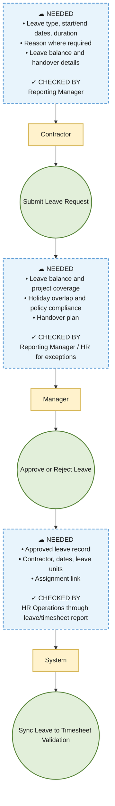

---

### Timesheet Submission & Confirmation

```mermaid
flowchart TD
  classDef cloud fill:#e8f4fc,stroke:#5b9bd5,stroke-width:2px,stroke-dasharray:6 4,color:#1a1a1a
  classDef actor fill:#fff2cc,stroke:#d6b656,stroke-width:2px,color:#1a1a1a
  classDef action fill:#e2efda,stroke:#548235,stroke-width:2px,color:#1a1a1a

  c1["☁ NEEDED<br/>• Active assignment and period<br/>• Project/task and daily hours<br/>• Leave/holiday coding<br/>• Source file if uploaded<br/><br/>✓ CHECKED BY<br/>Contractor and Reporting Manager"]
  a1["Contractor"]
  s1(("Upload Timesheet File (CSV/Excel) or Enter Weekly Hours"))

  c2["☁ NEEDED<br/>• Supported template<br/>• Contractor/assignment ID and period<br/>• Valid dates and hour values<br/><br/>✓ CHECKED BY<br/>Reporting Manager through parsed review"]
  a2["System"]
  s2(("Parse & Extract Daily Hours"))

  c3["☁ NEEDED<br/>• Parsed daily hours<br/>• Approved leave and holiday calendar<br/>• Assignment schedule and overtime rules<br/><br/>✓ CHECKED BY<br/>Reporting Manager and HR for exceptions"]
  a3["System"]
  s3(("Run Holiday/Leave Cross-Check (flags only)"))

  c4["☁ NEEDED<br/>• Validation results and timesheet summary<br/>• Contractor email and reporting manager<br/><br/>✓ CHECKED BY<br/>Finance Operations through delivery report"]
  a4["System"]
  s4(("Send Confirmation Email to Contractor (CC Reporting Manager)"))

  c5["☁ NEEDED<br/>• Secure link and timesheet summary<br/>• Exception flags<br/>• Explicit confirmation or rejection reason<br/><br/>✓ CHECKED BY<br/>Reporting Manager for disputed entries"]
  a5["Contractor"]
  s5(("Confirm Yes or No via Email Link"))

  c6["☁ NEEDED<br/>• Identity token, response, timestamp<br/>• Timesheet version and rejection comments<br/><br/>✓ CHECKED BY<br/>Finance Operations / Internal Audit"]
  a6["System"]
  s6(("Record Confirmation Status"))

  c7["☁ NEEDED<br/>• Confirmed/rejected status<br/>• Daily hours, exceptions, comments<br/><br/>✓ CHECKED BY<br/>Reporting Manager"]
  a7["Manager"]
  s7(("View Confirmed / Rejected Status in Portal (read-only)"))

  c8["☁ NEEDED<br/>• Contractor-confirmed timesheet<br/>• Resolved blocking exceptions<br/>• Active assignment and rate<br/><br/>✓ CHECKED BY<br/>Finance Approver during batch review"]
  a8["Finance"]
  s8(("Include Confirmed Hours in Payment Batch (downstream)"))

  c1 --> a1
  a1 --> s1
  s1 --> c2
  c2 --> a2
  a2 --> s2
  s2 --> c3
  c3 --> a3
  a3 --> s3
  s3 --> c4
  c4 --> a4
  a4 --> s4
  s4 --> c5
  c5 --> a5
  a5 --> s5
  s5 --> c6
  c6 --> a6
  a6 --> s6
  s6 --> c7
  c7 --> a7
  a7 --> s7
  s7 --> c8
  c8 --> a8
  a8 --> s8

  class c1,c2,c3,c4,c5,c6,c7,c8 cloud
  class a1,a2,a3,a4,a5,a6,a7,a8 actor
  class s1,s2,s3,s4,s5,s6,s7,s8 action
```

---

### Reporting Anomaly Detection & Resolution

```mermaid
flowchart TD
  classDef cloud fill:#e8f4fc,stroke:#5b9bd5,stroke-width:2px,stroke-dasharray:6 4,color:#1a1a1a
  classDef actor fill:#fff2cc,stroke:#d6b656,stroke-width:2px,color:#1a1a1a
  classDef action fill:#e2efda,stroke:#548235,stroke-width:2px,color:#1a1a1a

  c1["☁ NEEDED<br/>• Current contractor, assignment, manager<br/>• Project and rate records<br/>• Anomaly detection rules<br/><br/>✓ CHECKED BY<br/>HR / Finance Operations"]
  a1["System"]
  s1(("Detect Anomaly (Stale Manager, Missing Rate, Inactive Project Assignment)"))

  c2["☁ NEEDED<br/>• Anomaly type and severity<br/>• Impacted entity and due date<br/>• Functional ownership<br/><br/>✓ CHECKED BY<br/>HR / Finance Lead"]
  a2["HR / Finance"]
  s2(("Assign Owner"))

  c3["☁ NEEDED<br/>• Source records and root cause<br/>• Supporting evidence<br/>• Authorized correction and resolution comments<br/><br/>✓ CHECKED BY<br/>HR / Finance Lead — independent of resolver"]
  a3["Owner"]
  s3(("Investigate & Resolve"))

  c4["☁ NEEDED<br/>• Corrected records and validator sign-off<br/>• No remaining rule failure<br/>• Audit evidence<br/><br/>✓ CHECKED BY<br/>HR / Finance Lead"]
  a4["System"]
  s4(("Mark Anomaly Resolved"))

  c1 --> a1
  a1 --> s1
  s1 --> c2
  c2 --> a2
  a2 --> s2
  s2 --> c3
  c3 --> a3
  a3 --> s3
  s3 --> c4
  c4 --> a4
  a4 --> s4

  class c1,c2,c3,c4 cloud
  class a1,a2,a3,a4 actor
  class s1,s2,s3,s4 action
```

---

### Contractor Performance Concern & Work Verification

```mermaid
flowchart TD
  classDef cloud fill:#e8f4fc,stroke:#5b9bd5,stroke-width:2px,stroke-dasharray:6 4,color:#1a1a1a
  classDef actor fill:#fff2cc,stroke:#d6b656,stroke-width:2px,color:#1a1a1a
  classDef action fill:#e2efda,stroke:#548235,stroke-width:2px,color:#1a1a1a

  c1["☁ NEEDED<br/>• Active assignment and reporting relationship<br/>• Concern reason and affected period<br/>• Evidence or examples (missed deliverables, no output)<br/><br/>✓ CHECKED BY<br/>Reporting Manager"]
  a1["Manager"]
  s1(("Flag Contractor for Performance Concern (Reason, Period, Evidence)"))

  c2["☁ NEEDED<br/>• Valid flag with contractor, project, and period<br/>• Notification recipients and case ID<br/><br/>✓ CHECKED BY<br/>HR Operations Lead"]
  a2["System"]
  s2(("Notify HR Operations & Record Flag"))

  c3["☁ NEEDED<br/>• Contractor contact and investigation plan<br/>• Work artefacts, deliverables, repo/submission links<br/>• Timesheet hours under review<br/><br/>✓ CHECKED BY<br/>HR Operations Lead"]
  a3["HR Operations"]
  s3(("Connect with Contractor & Review Work (Deliverables, Artefacts, Online Submissions)"))

  c4["☁ NEEDED<br/>• Meeting notes and evidence reviewed<br/>• Contractor response<br/>• Finding: no issue, partial non-work, or sustained non-work<br/><br/>✓ CHECKED BY<br/>HR Operations Lead"]
  a4["HR Operations"]
  s4(("Record Investigation Findings"))

  c5["☁ NEEDED<br/>• HR investigation summary<br/>• Manager review of findings<br/>• Confirmed outcome<br/><br/>✓ CHECKED BY<br/>Reporting Manager and HR Lead"]
  a5["Manager"]
  s5(("Review Findings & Confirm Outcome"))

  c6["☁ NEEDED<br/>• Sustained non-work finding<br/>• Disputed hours and period<br/>• Vendor manager contact<br/><br/>✓ CHECKED BY<br/>HR Lead"]
  a6["HR Operations"]
  s6(("Notify Vendor Manager (No Payment for Unworked Hours) if sustained"))

  c7["☁ NEEDED<br/>• Confirmed disputed hours<br/>• Linked timesheet/payment batch lines<br/>• Adjustment reason and audit trail<br/><br/>✓ CHECKED BY<br/>Finance Controller"]
  a7["Finance"]
  s7(("Adjust or Block Disputed Timesheet Hours"))

  c8["☁ NEEDED<br/>• Final case outcome<br/>• Investigation evidence<br/>• Payment adjustment if any<br/><br/>✓ CHECKED BY<br/>HR Lead / Compliance"]
  a8["System"]
  s8(("Record Case Outcome on Contractor Credibility Record"))

  c1 --> a1
  a1 --> s1
  s1 --> c2
  c2 --> a2
  a2 --> s2
  s2 --> c3
  c3 --> a3
  a3 --> s3
  s3 --> c4
  c4 --> a4
  a4 --> s4
  s4 --> c5
  c5 --> a5
  a5 --> s5
  s5 --> c6
  c6 --> a6
  a6 --> s6
  s6 --> c7
  c7 --> a7
  a7 --> s7
  s7 --> c8
  c8 --> a8
  a8 --> s8

  class c1,c2,c3,c4,c5,c6,c7,c8 cloud
  class a1,a2,a3,a4,a5,a6,a7,a8 actor
  class s1,s2,s3,s4,s5,s6,s7,s8 action
```

_Use when a manager suspects a contractor is not performing or not working claimed hours. HR Operations investigates before payment adjustment. Vendor manager is notified when non-work is sustained._

---

### Contractor Quarterly Performance Rating

```mermaid
flowchart TD
  classDef cloud fill:#e8f4fc,stroke:#5b9bd5,stroke-width:2px,stroke-dasharray:6 4,color:#1a1a1a
  classDef actor fill:#fff2cc,stroke:#d6b656,stroke-width:2px,color:#1a1a1a
  classDef action fill:#e2efda,stroke:#548235,stroke-width:2px,color:#1a1a1a

  c1["☁ NEEDED<br/>• Quarter and rating period<br/>• Active contractors with assignments<br/>• Rating rubric and due date<br/><br/>✓ CHECKED BY<br/>HR Operations Lead"]
  a1["System"]
  s1(("Open Quarterly Rating Cycle"))

  c2["☁ NEEDED<br/>• Active assignment during rating period<br/>• Rubric: quality, communication, delivery<br/>• Professionalism and reliability<br/><br/>✓ CHECKED BY<br/>Reporting Manager"]
  a2["Manager"]
  s2(("Rate Contractor on Rubric (Quality, Communication, Delivery, Professionalism, Reliability)"))

  c3["☁ NEEDED<br/>• Completed rubric scores<br/>• Written comments and examples<br/>• Overall rating<br/><br/>✓ CHECKED BY<br/>Reporting Manager"]
  a3["Manager"]
  s3(("Submit Rating & Comments"))

  c4["☁ NEEDED<br/>• All rubric fields complete<br/>• Comments where required<br/>• No conflict of interest<br/><br/>✓ CHECKED BY<br/>HR Operations Lead"]
  a4["HR Operations"]
  s4(("Review Rating for Completeness"))

  c5["☁ NEEDED<br/>• Validated rating and quarter<br/>• Contractor, manager, project link<br/>• Immutable credibility record entry<br/><br/>✓ CHECKED BY<br/>HR Lead"]
  a5["System"]
  s5(("Store Rating on Contractor Credibility Record"))

  c6["☁ NEEDED<br/>• Rating history and trend<br/>• Open roles and transfer requests<br/>• Vendor and project context<br/><br/>✓ CHECKED BY<br/>HR Lead / TAQ Lead"]
  a6["HR / TAQ"]
  s6(("Use Rating History for Project Assignment & Transfer Decisions"))

  c1 --> a1
  a1 --> s1
  s1 --> c2
  c2 --> a2
  a2 --> s2
  s2 --> c3
  c3 --> a3
  a3 --> s3
  s3 --> c4
  c4 --> a4
  a4 --> s4
  s4 --> c5
  c5 --> a5
  a5 --> s5
  s5 --> c6
  c6 --> a6
  a6 --> s6

  class c1,c2,c3,c4,c5,c6 cloud
  class a1,a2,a3,a4,a5,a6 actor
  class s1,s2,s3,s4,s5,s6 action
```

_Ratings run every quarter and build a credibility record that travels with the contractor across projects and managers._

---

## Money

### Contractor Rate Lifecycle

```mermaid
flowchart TD
  classDef cloud fill:#e8f4fc,stroke:#5b9bd5,stroke-width:2px,stroke-dasharray:6 4,color:#1a1a1a
  classDef actor fill:#fff2cc,stroke:#d6b656,stroke-width:2px,color:#1a1a1a
  classDef action fill:#e2efda,stroke:#548235,stroke-width:2px,color:#1a1a1a

  c1["☁ NEEDED<br/>• Contractor, assignment, vendor<br/>• Role/skill/grade, currency<br/>• Pay/bill rate, unit, overtime<br/>• Effective dates and rate-card version<br/><br/>✓ CHECKED BY<br/>HR Lead"]
  a1["HR"]
  s1(("Create Contractor Rate"))

  c2["☁ NEEDED<br/>• Active/pending assignment<br/>• Approved rate card<br/>• Matching project/role/dates<br/>• Budget and margin rules<br/><br/>✓ CHECKED BY<br/>HR and Finance through exception review"]
  a2["System"]
  s2(("Validate Assignment & Rate Card Alignment"))

  c3["☁ NEEDED<br/>• Passed checks and benchmark<br/>• Budget/margin impact<br/>• Supporting agreement and exception reason<br/><br/>✓ CHECKED BY<br/>HR Lead"]
  a3["HR"]
  s3(("Submit for Finance Approval"))

  c4["☁ NEEDED<br/>• Approved rate card and available budget<br/>• Acceptable margin and effective dates<br/>• Tax treatment<br/><br/>✓ CHECKED BY<br/>Finance Approver / Finance Head"]
  a4["Finance"]
  s4(("Approve Rate"))

  c5["☁ NEEDED<br/>• Finance approval<br/>• Valid assignment and non-overlapping rate period<br/>• Effective date<br/><br/>✓ CHECKED BY<br/>Finance Operations"]
  a5["System"]
  s5(("Activate Rate"))

  c6["☁ NEEDED<br/>• Active approved version<br/>• Actor, timestamp, complete change history<br/><br/>✓ CHECKED BY<br/>Finance Controller / Internal Audit"]
  a6["System"]
  s6(("Lock Version (Immutable)"))

  c1 --> a1
  a1 --> s1
  s1 --> c2
  c2 --> a2
  a2 --> s2
  s2 --> c3
  c3 --> a3
  a3 --> s3
  s3 --> c4
  c4 --> a4
  a4 --> s4
  s4 --> c5
  c5 --> a5
  a5 --> s5
  s5 --> c6
  c6 --> a6
  a6 --> s6

  class c1,c2,c3,c4,c5,c6 cloud
  class a1,a2,a3,a4,a5,a6 actor
  class s1,s2,s3,s4,s5,s6 action
```

_Note: During onboarding, assignment is created in Draft/Pending before rate submission. Rate activation and assignment activation occur together after Finance approval._

---

### Finance Payment Batch

```mermaid
flowchart TD
  classDef cloud fill:#e8f4fc,stroke:#5b9bd5,stroke-width:2px,stroke-dasharray:6 4,color:#1a1a1a
  classDef actor fill:#fff2cc,stroke:#d6b656,stroke-width:2px,color:#1a1a1a
  classDef action fill:#e2efda,stroke:#548235,stroke-width:2px,color:#1a1a1a

  c1["☁ NEEDED<br/>• Closed period<br/>• Contractor-confirmed timesheets<br/>• Active assignment/rate<br/>• Vendor and project mapping<br/><br/>✓ CHECKED BY<br/>Finance Operations"]
  a1["Finance"]
  s1(("Generate Batch from Contractor-Confirmed Timesheets"))

  c2["☁ NEEDED<br/>• Assignment, rate version, reporting manager<br/>• Confirmed hours and leave/holiday results<br/>• Duplicate check<br/><br/>✓ CHECKED BY<br/>Finance Operations through validation report"]
  a2["System"]
  s2(("Validate Assignment, Rate & Reporting Manager"))

  c3["☁ NEEDED<br/>• Failed rule, impacted line<br/>• Amount, reason, severity<br/><br/>✓ CHECKED BY<br/>Finance Controller"]
  a3["System"]
  s3(("Flag Exceptions (Blocked Lines)"))

  c4["☁ NEEDED<br/>• Exception evidence<br/>• Correction/exclusion reason<br/>• Revised batch total and audit trail<br/><br/>✓ CHECKED BY<br/>Finance Controller — independent of preparer"]
  a4["Finance"]
  s4(("Review & Remove Blocked Lines"))

  c5["☁ NEEDED<br/>• Clean batch and totals by vendor/project<br/>• Variance report and exception disposition<br/>• Budget availability<br/><br/>✓ CHECKED BY<br/>Finance Approver / Finance Head"]
  a5["Finance"]
  s5(("Approve Batch"))

  c6["☁ NEEDED<br/>• Finance approval, batch version<br/>• Final total and no blocked lines<br/><br/>✓ CHECKED BY<br/>Finance Controller"]
  a6["System"]
  s6(("Mark Batch Ready for Invoicing"))

  c1 --> a1
  a1 --> s1
  s1 --> c2
  c2 --> a2
  a2 --> s2
  s2 --> c3
  c3 --> a3
  a3 --> s3
  s3 --> c4
  c4 --> a4
  a4 --> s4
  s4 --> c5
  c5 --> a5
  a5 --> s5
  s5 --> c6
  c6 --> a6
  a6 --> s6

  class c1,c2,c3,c4,c5,c6 cloud
  class a1,a2,a3,a4,a5,a6 actor
  class s1,s2,s3,s4,s5,s6 action
```

---

### Invoice Approval

```mermaid
flowchart TD
  classDef cloud fill:#e8f4fc,stroke:#5b9bd5,stroke-width:2px,stroke-dasharray:6 4,color:#1a1a1a
  classDef actor fill:#fff2cc,stroke:#d6b656,stroke-width:2px,color:#1a1a1a
  classDef action fill:#e2efda,stroke:#548235,stroke-width:2px,color:#1a1a1a

  c1["☁ NEEDED<br/>• Unique invoice number<br/>• Vendor legal/tax details and invoice date<br/>• Service period and project/SOW/PO<br/>• Approved payment batch<br/>• Contractor-wise hours and rates<br/>• Subtotal, tax, total, currency<br/>• Bank details and supporting timesheets<br/><br/>✓ CHECKED BY<br/>Vendor Authorized Signatory"]
  a1["Vendor / Finance"]
  s1(("Submit or Upload Invoice"))

  c2["☁ NEEDED<br/>• Readable invoice and mandatory tax fields<br/>• Duplicate check<br/>• Active vendor and valid PO/SOW<br/>• Service period<br/><br/>✓ CHECKED BY<br/>Finance Accounts Payable"]
  a2["Finance"]
  s2(("Perform Invoice Completeness & Compliance Check"))

  c3["☁ NEEDED<br/>• Invoice lines and approved batch hours/rates<br/>• PO/SOW limits and tax rules<br/>• Prior invoices/credits<br/><br/>✓ CHECKED BY<br/>Finance Accounts Payable"]
  a3["System"]
  s3(("Reconcile Invoice Against Approved Payment Batch and PO/SOW"))

  c4["☁ NEEDED<br/>• Reconciliation report<br/>• Variance amount/reason<br/>• Supporting correction or credit note<br/><br/>✓ CHECKED BY<br/>Finance Controller"]
  a4["Finance / Vendor"]
  s4(("Resolve Reconciliation Exceptions"))

  c5["☁ NEEDED<br/>• Matched hours/deliverables<br/>• Service period and contractor/project allocation<br/>• Manager evidence<br/><br/>✓ CHECKED BY<br/>Reporting / Project Manager"]
  a5["Project Manager"]
  s5(("Confirm Services and Approved Hours"))

  c6["☁ NEEDED<br/>• Project-manager confirmation<br/>• Project budget and cost centre<br/>• PO balance and invoice total<br/><br/>✓ CHECKED BY<br/>Budget Owner / Program Manager"]
  a6["Budget Owner"]
  s6(("Approve Invoice Charge"))

  c7["☁ NEEDED<br/>• Compliance check and successful reconciliation<br/>• Service confirmation and budget approval<br/>• Tax and bank verification<br/><br/>✓ CHECKED BY<br/>Finance Approver — independent of preparer"]
  a7["Finance"]
  s7(("Approve or Reject Invoice"))

  c8["☁ NEEDED<br/>• Invoice above value/risk threshold<br/>• First approval and complete evidence<br/><br/>✓ CHECKED BY<br/>Second Finance Approver / Finance Head"]
  a8["Finance"]
  s8(("Run Dual Approval (when threshold or policy requires)"))

  c9["☁ NEEDED<br/>• All required approvals<br/>• Final invoice version<br/>• No unresolved blocking exceptions<br/>• Due date<br/><br/>✓ CHECKED BY<br/>Finance Controller / AP Lead"]
  a9["System"]
  s9(("Mark Invoice Approved and Eligible for Payment"))

  c1 --> a1
  a1 --> s1
  s1 --> c2
  c2 --> a2
  a2 --> s2
  s2 --> c3
  c3 --> a3
  a3 --> s3
  s3 --> c4
  c4 --> a4
  a4 --> s4
  s4 --> c5
  c5 --> a5
  a5 --> s5
  s5 --> c6
  c6 --> a6
  a6 --> s6
  s6 --> c7
  c7 --> a7
  a7 --> s7
  s7 --> c8
  c8 --> a8
  a8 --> s8
  s8 --> c9
  c9 --> a9
  a9 --> s9

  class c1,c2,c3,c4,c5,c6,c7,c8,c9 cloud
  class a1,a2,a3,a4,a5,a6,a7,a8,a9 actor
  class s1,s2,s3,s4,s5,s6,s7,s8,s9 action
```

_Control note: The requester/uploader, service confirmer, budget approver, and Finance approver must be separate people where staffing permits. Any segregation-of-duties exception requires documented Finance Head approval._

---

### Invoice Payment & Settlement

```mermaid
flowchart TD
  classDef cloud fill:#e8f4fc,stroke:#5b9bd5,stroke-width:2px,stroke-dasharray:6 4,color:#1a1a1a
  classDef actor fill:#fff2cc,stroke:#d6b656,stroke-width:2px,color:#1a1a1a
  classDef action fill:#e2efda,stroke:#548235,stroke-width:2px,color:#1a1a1a

  c1["☁ NEEDED<br/>• Approved invoice and payment batch<br/>• Due date and verified vendor bank details<br/>• Payment terms and no payment hold<br/><br/>✓ CHECKED BY<br/>Finance Accounts Payable"]
  a1["Finance"]
  s1(("Schedule Approved Invoice for Payment"))

  c2["☁ NEEDED<br/>• Payment proposal and invoice total<br/>• Credits/withholding and currency<br/>• Value date, bank beneficiary<br/>• Cash availability<br/><br/>✓ CHECKED BY<br/>Finance Controller"]
  a2["Finance"]
  s2(("Generate Payment File / Bank Instruction"))

  c3["☁ NEEDED<br/>• Payment instruction and bank proof<br/>• Approved invoice list and total<br/>• Maker-checker separation<br/><br/>✓ CHECKED BY<br/>Authorized Payment Approver / Treasury"]
  a3["Finance / Treasury"]
  s3(("Approve and Release Payment"))

  c4["☁ NEEDED<br/>• Bank confirmation/reference<br/>• Paid amount/date and withholding details<br/>• Invoice and batch IDs<br/><br/>✓ CHECKED BY<br/>Finance Accounts Payable and Finance Controller"]
  a4["System"]
  s4(("Mark Invoice and Batch Paid"))

  c5["☁ NEEDED<br/>• Payment reference and remittance details<br/>• Vendor contact and final paid amount<br/><br/>✓ CHECKED BY<br/>Finance Accounts Payable"]
  a5["System"]
  s5(("Send Remittance Advice to Vendor"))

  c1 --> a1
  a1 --> s1
  s1 --> c2
  c2 --> a2
  a2 --> s2
  s2 --> c3
  c3 --> a3
  a3 --> s3
  s3 --> c4
  c4 --> a4
  a4 --> s4
  s4 --> c5
  c5 --> a5
  a5 --> s5

  class c1,c2,c3,c4,c5 cloud
  class a1,a2,a3,a4,a5 actor
  class s1,s2,s3,s4,s5 action
```
